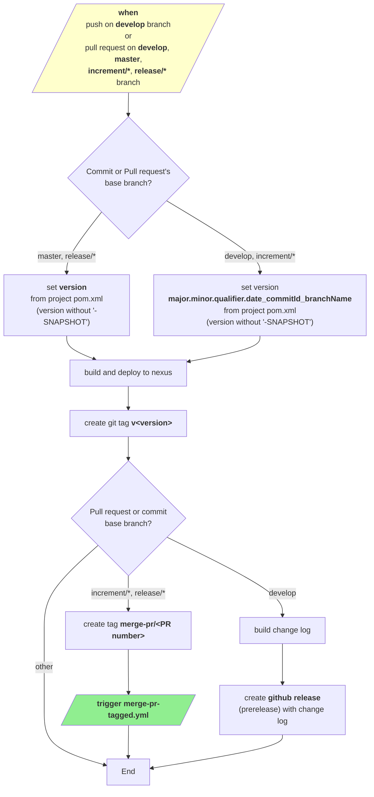
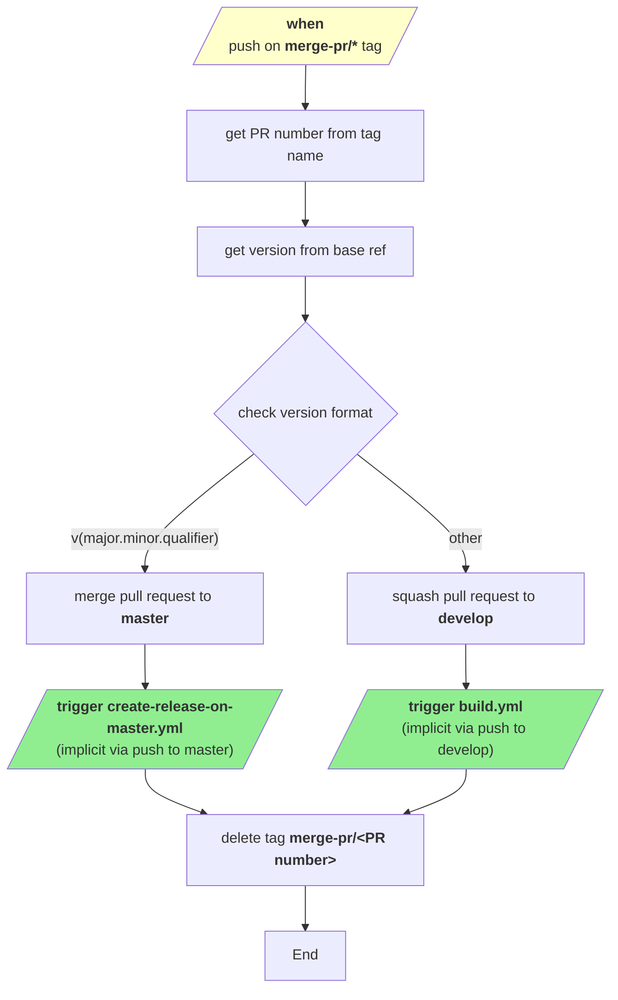
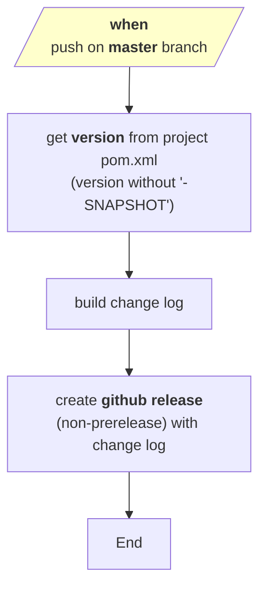
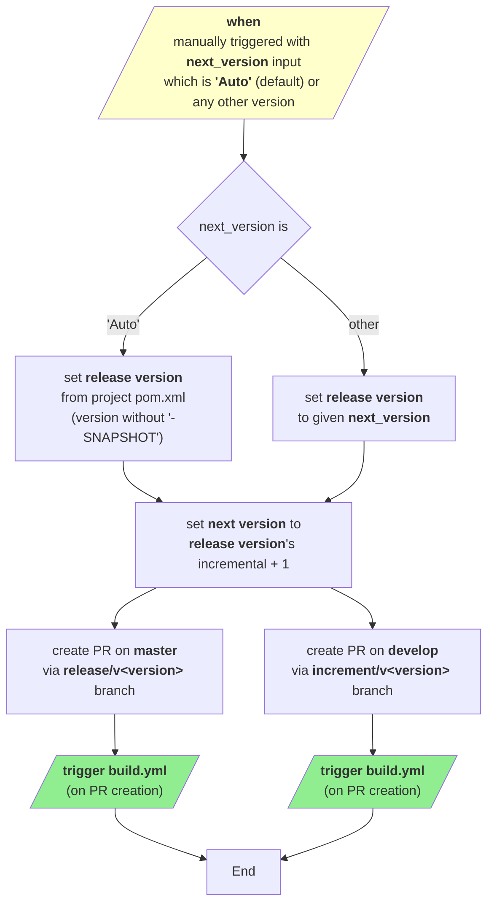

# Development version and branch handling

## Table of Contents
- [Branches](#branches)
- [Version numbers](#version-numbers)
- [GitHub action flows](#github-action-flows)
- [How to develop](#how-to-develop)

## Branches

Versioning policy of JUDO NG modules are based on [GitFlow workflow](https://www.atlassian.com/git/tutorials/comparing-workflows/gitflow-workflow).

Branches:

* **develop**: development branch contains latest development sources of the last active version
* **feature/JNG-NUMBER_short_summary**: feature branches are based on **develop** and contains sources of new features that will be included in last active version
* **(release/)1_0_beta1**: release branches of 1.0-beta1 (release/ prefix is still reserved for CI)
* **bugfix/JNG-NUMBER_short_summary**, **support/JNG-NUMBER_short_summary**: bugfix and support branches are based on release branches and must be applied to release and development branches of newer versions too
* **master**: contains latest released sources of the last active version

```mermaid
%%{init: {'theme': 'base', 'gitGraph': {'rotateCommitLabel': false}}}%%
gitGraph
    commit id: "init"
    branch develop order: 1
    commit id: "d1"
    
    branch feature/JNG-2 order: 2
    commit id: "f2-1"
    commit id: "f2-2"
    checkout develop
    merge feature/JNG-2 id: "merge-f2"
    
    branch feature/JNG-1 order: 3
    commit id: "f1-1"
    commit id: "f1-2"
    checkout develop
    merge feature/JNG-1 id: "merge-f1"
    
    branch feature/JNG-3 order: 4
    commit id: "f3-1"
    checkout develop
    merge feature/JNG-3 id: "merge-f3"
    
    branch release/1.0-beta1 order: 5
    commit id: "r1-1"
    
    branch bugfix/JNG-4 order: 6
    commit id: "bf-1"
    checkout release/1.0-beta1
    merge bugfix/JNG-4 id: "merge-bf"
    
    checkout develop
    merge release/1.0-beta1 id: "merge-r1"
    
    branch release/1.0-beta2 order: 7
    commit id: "r2-1"
    
    branch support/JNG-5 order: 8
    commit id: "sp-1"
    checkout release/1.0-beta2
    merge support/JNG-5 id: "merge-sp"
    
    checkout master
    merge release/1.0-beta2 id: "release-1.0"
    
    branch hotfix/JNG-6 order: 9
    commit id: "hf-1"
    checkout master
    merge hotfix/JNG-6 id: "merge-hf"
    
    checkout develop
    merge master id: "sync-hf"
    
    branch release/1.1-beta1 order: 10
    commit id: "r3-1"
    checkout master
    merge release/1.1-beta1 id: "release-1.1"
```

**Branch Legend:**

| Branch Type | Color      | Purpose                        |
|-------------|------------|--------------------------------|
| master      | Green      | Latest released sources        |
| develop     | Blue       | Latest development sources     |
| feature/*   | Gold       | New features                   |
| release/*   | Cyan       | Release preparation            |
| bugfix/*    | Red        | Bug fixes on release branches  |
| support/*   | Aquamarine | Support for previous releases  |
| hotfix/*    | Dark Red   | Urgent fixes for production    |

## Version numbers

Version numbers are increased using semantic versioning:

* do not change version numbers on starting feature/ branches
* 2nd number in version of **develop** branch is increased when a release branch started
* do not change version numbers on bugfix/ branches - that are applied on release branches during testing before releasing it (merging to master)
* 3rd number in version of support/ branches is increased when started - it is used to support a previous release including new (minor) changes; support/ branches are merged back to release branch when update is released (without merging changes to master)
* 4th number in version of hotfix/ branches is increased when started (that are applied on both release and master branches)

## GitHub action flows

### build.yml



### merge-pr-tagged.yml



### create-release-on-master.yml



### release.yml



## How to develop

For issue tracking we are using [JIRA](https://blackbelt.atlassian.net/jira/dashboards). Golden rule:

> **IMPORTANT: There is no commit without ticket number**

So for pull request or commit `JNG-xxx` have to be presented in the commit.
