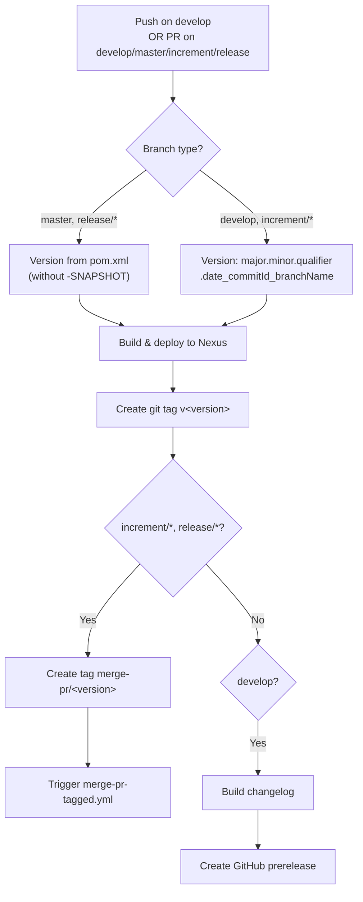
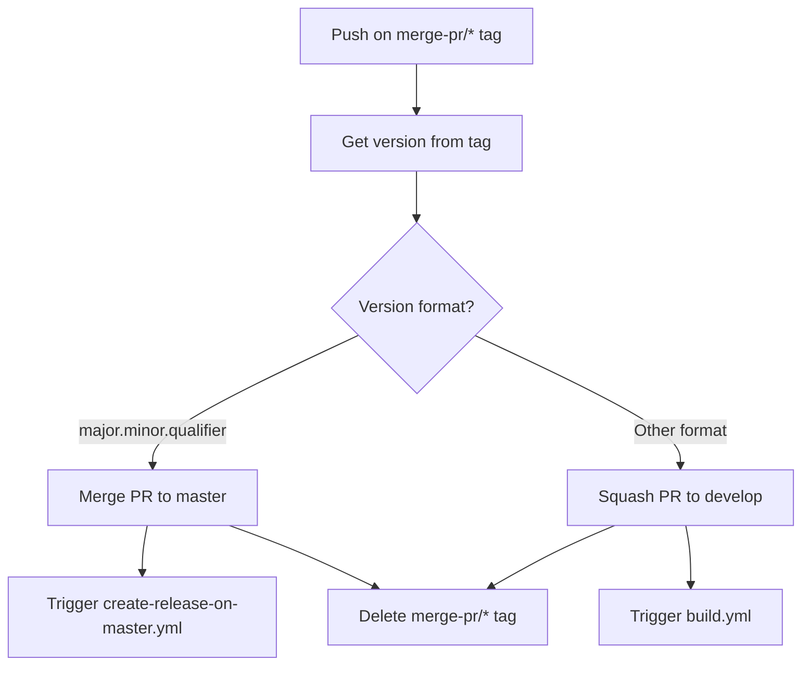
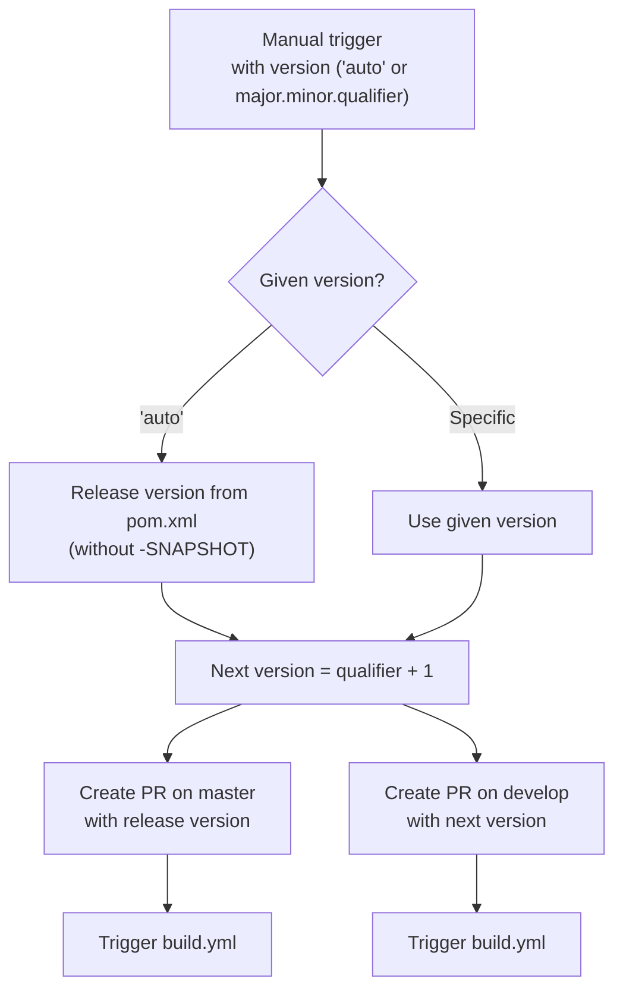

# Development Version and Branch Handling

## Branches

The versioning policy follows [GitFlow](https://www.atlassian.com/git/tutorials/comparing-workflows/gitflow-workflow).

| Branch Pattern | Purpose |
|----------------|---------|
| `develop` | Main development branch — contains latest sources of the active version |
| `feature/JNG-NUMBER_short_summary` | Feature branches based on `develop` |
| `(release/)X_Y_betaN` | Release branches (the `release/` prefix is reserved for CI) |
| `bugfix/JNG-NUMBER_short_summary` | Bugfixes based on release branches — must be applied to newer versions too |
| `support/JNG-NUMBER_short_summary` | Support branches based on release branches |
| `master` | Latest released sources of the active version |

```mermaid
gitGraph
    commit id: "init"
    branch develop
    checkout develop
    commit id: "dev-1"
    branch feature/JNG-1
    commit id: "feat-1"
    commit id: "feat-2"
    checkout develop
    merge feature/JNG-1 id: "merge-feat-1"
    branch feature/JNG-2
    commit id: "feat-3"
    checkout develop
    merge feature/JNG-2 id: "merge-feat-2"
    branch release/1.0-beta1
    commit id: "rc-1"
    branch bugfix/JNG-4
    commit id: "fix-1"
    checkout release/1.0-beta1
    merge bugfix/JNG-4 id: "merge-fix"
    checkout develop
    merge release/1.0-beta1 id: "merge-release"
    checkout master
    merge release/1.0-beta1 id: "v1.0"
```

## Version Numbers

Version numbers use semantic versioning with these rules:

| Event | Version Change |
|-------|---------------|
| Start a `feature/` branch | No change |
| Start a `release/` branch from `develop` | 2nd number on `develop` is incremented |
| `bugfix/` branch on a release | No change (applied before merging to master) |
| `support/` branch | 3rd number incremented — for minor changes to a previous release |
| `hotfix/` branch | 4th number incremented — applied to both release and master |

## GitHub Actions Workflows

The CI/CD pipeline consists of several interconnected GitHub Actions workflows that automate building, testing, versioning, and releasing.

### build.yml — Main Build Pipeline



### merge-pr-tagged.yml — Auto-merge Handler



### release.yml — Manual Release



### create-release-on-master.yml

Triggered by a push on `master` — builds a changelog and creates a GitHub release (marked as latest).

## Development Rules

> **Important:** There is no commit without a ticket number. Every pull request and commit must include a `JNG-xxx` JIRA reference.

Issue tracking uses [JIRA](https://blackbelt.atlassian.net/jira/dashboards).
