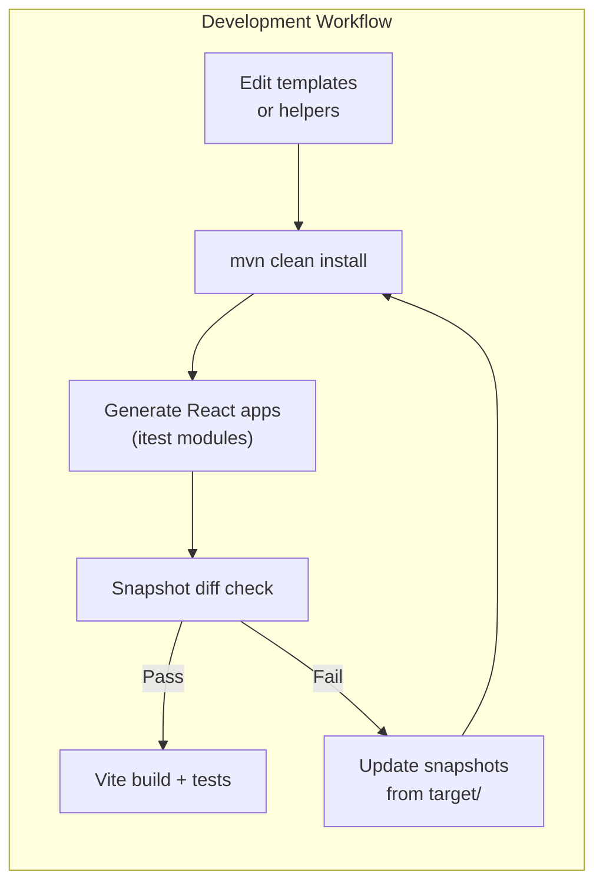

# Contributing to JUDO UI React Template

## Development Environment

Make sure your development environment complies with the requirements from the parent project's [CONTRIBUTING](https://github.com/BlackBeltTechnology/judo-community/blob/develop/CONTRIBUTING.adoc) guide.

**Required tooling:**

| Tool | Version | Installation |
|------|---------|-------------|
| Java | 21 | Via sdkman: `sdk env` |
| Maven | 3.9.4+ | Via sdkman |
| Node.js | 22.14.0 | Auto-installed by `frontend-maven-plugin` during build |
| pnpm | 9.15.9 | Auto-installed by `frontend-maven-plugin` during build |

## Code Structure

This project is a **code generator** — it does not contain a runnable application itself. Instead, it produces React/TypeScript applications from JUDO UI Models. The main development work involves:

- **Handlebars templates** (`judo-ui-react/src/main/resources/actor/`) that define the generated output
- **Java helper classes** (`judo-ui-react/src/main/java/`) that provide template utility functions
- **Integration tests** (`judo-ui-react-itest/`) that verify generated code compiles and passes snapshot checks



## Commands

### Run Tests

```sh
mvn clean test
```

### Run Full Build

```sh
mvn clean install
```

### Build a Single Integration Test

```sh
mvn clean install -pl judo-ui-react-itest/ActionGroupTest/action_group_test__god -am
```

### Parallel Build (requires mvnd via sdkman)

```sh
./full-build-parallel.sh
```

## Submission Guidelines

### Submitting an Issue

Before submitting, search the [issue tracker](https://github.com/BlackBeltTechnology/judo-ui-react-template/issues) — your problem may already exist or have a known workaround.

To help us reproduce and fix bugs quickly, please include:

- Output of `java -version` and `mvn -version`
- Relevant `pom.xml` or `.flattened-pom.xml`
- A minimal use-case that reproduces the failure

File new issues using the [issue form](https://github.com/BlackBeltTechnology/judo-ui-react-template/issues/new/choose).

### Submitting a PR

This project follows [GitHub's standard forking model](https://guides.github.com/activities/forking/). Please fork the project to submit pull requests.
