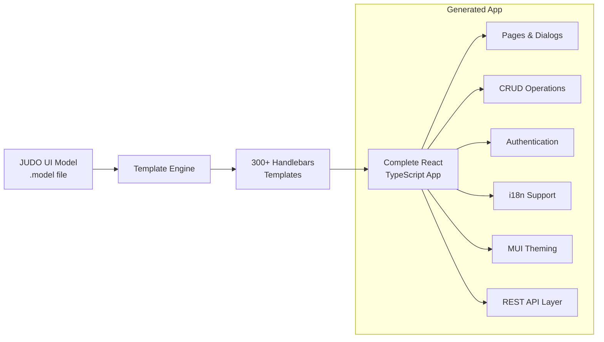
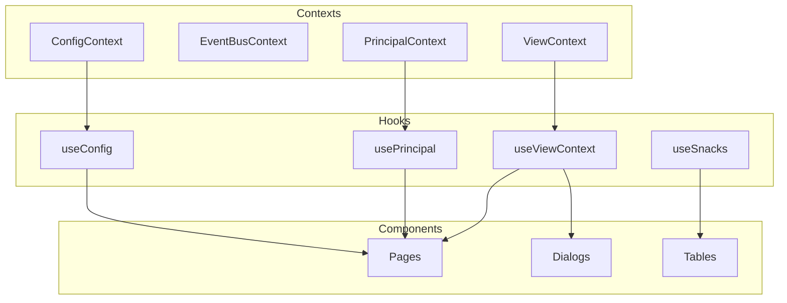
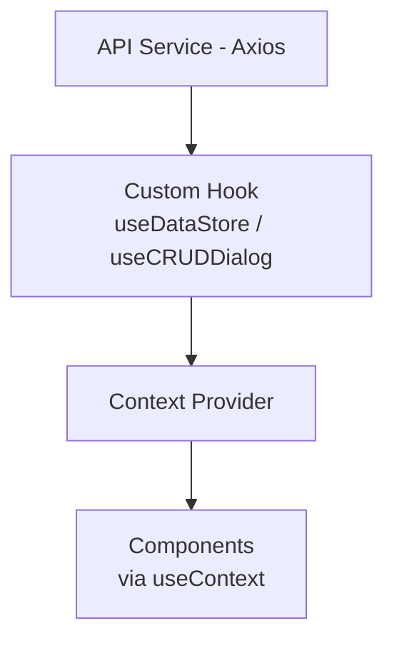
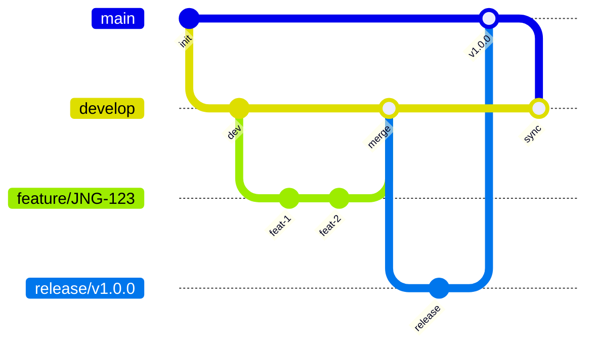
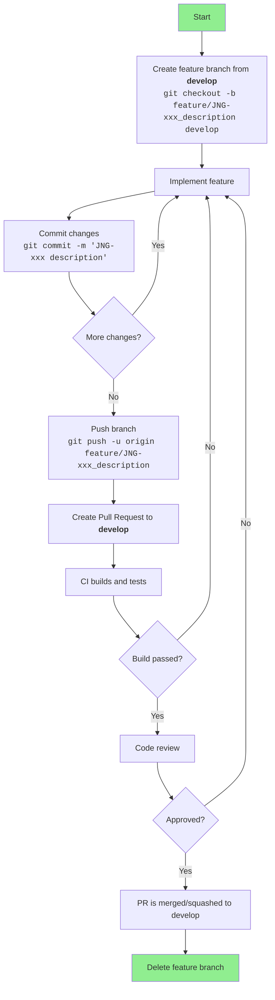
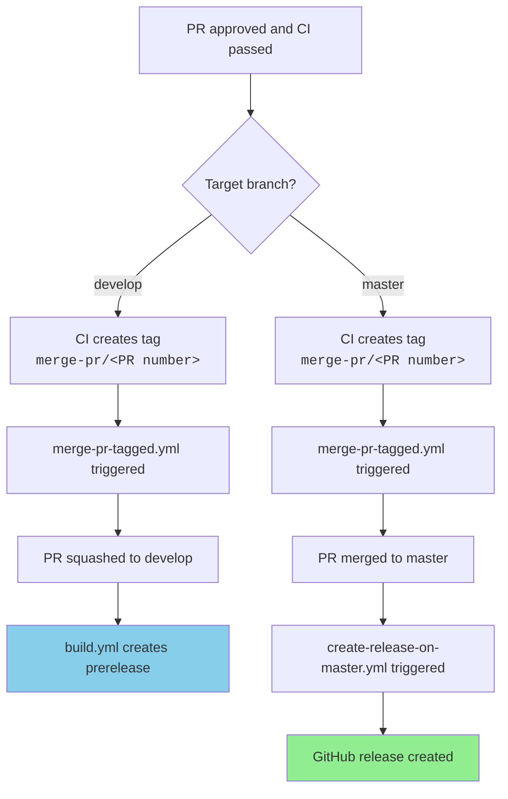
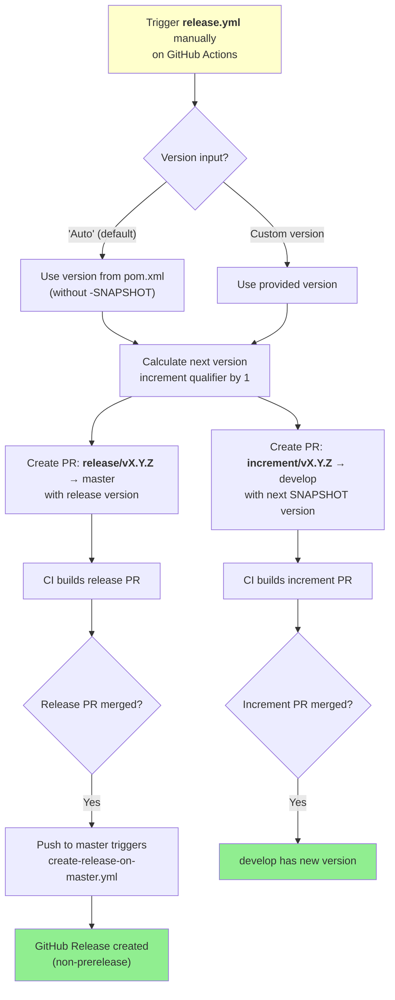
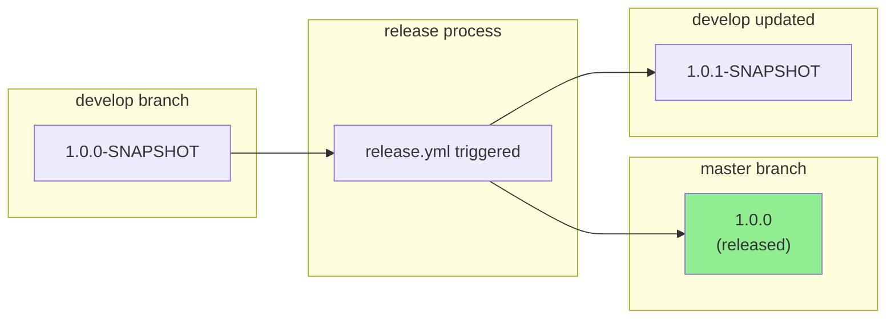
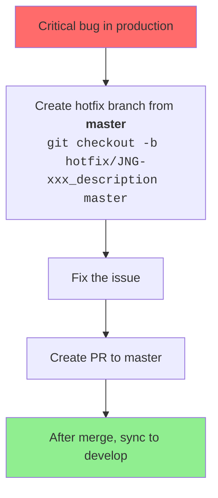

# JUDO UI React Template

[](https://www.eclipse.org/legal/epl-2.0/)

A code generation framework that transforms JUDO UI meta-models into fully functional React TypeScript applications. It uses Handlebars templates with Spring Expression Language (SpEL) to generate complete frontend applications.

## Features

- Generates complete React TypeScript applications from JUDO UI models
- 300+ Handlebars templates for comprehensive code generation
- Material-UI (MUI) component library integration
- Built-in authentication and authorization
- Internationalization (i18n) support
- REST API integration via Axios
- CRUD operations and data tables with filtering
- Responsive design with collapsible filter panels

## Technology Stack

| Component | Technology |
|-----------|------------|
| Generator Language | Java 21 |
| Generated App Language | TypeScript |
| Build Tool | Maven 3.9.4 |
| Template Engine | Handlebars 4.4.0 |
| Expression Language | Spring Expression (SpEL) |
| Frontend Framework | React 19 |
| UI Library | Material-UI (MUI) |
| Build Tool (Frontend) | Vite |
| Package Manager | pnpm |
| Packaging | OSGi Bundle |

## How It Works



## Requirements

- Java 21
- Maven 3.9.4+
- Node.js 22.11.0 (auto-installed via Maven)
- pnpm 9.12.3 (auto-installed via Maven)

## Quick Start

### Build Commands

```bash
# Full build (recommended)
./full-build-parallel.sh

# Standard Maven build
mvn clean install

# Skip tests
mvn clean install -DskipTests

# Build specific module
mvn clean install -pl judo-ui-react

# Run with Maven daemon (faster)
mvnd clean install
```

## Usage

The source code generated by this template depends on the services generated by [judo-ui-typescript-rest-template](https://github.com/BlackBeltTechnology/judo-ui-typescript-rest-template).

### Maven Configuration Example

```xml
<project xmlns="http://maven.apache.org/POM/4.0.0" xmlns:xsi="http://www.w3.org/2001/XMLSchema-instance"
         xsi:schemaLocation="http://maven.apache.org/POM/4.0.0 https://maven.apache.org/xsd/maven-4.0.0.xsd">
    <modelVersion>4.0.0</modelVersion>

    <groupId>com.example</groupId>
    <artifactId>actiongrouptest-frontend-react-action_group_test__god</artifactId>
    <version>1.0.0-SNAPSHOT</version>

    <name>ActionGroupTest - God</name>
    <description>ActionGroupTest - God react frontend</description>

    <packaging>bundle</packaging>

    <properties>
        <!-- dependencies -->
        <judo-meta-ui-version>1.0.1.20230213_193724_b9e98a1c_develop</judo-meta-ui-version>
        <judo-generator-commons-version>1.0.0.20230120_203628_b0fbaa8e_develop</judo-generator-commons-version>
        <judo-ui-typescript-rest-template-version>1.0.0.20230227_135344_7ab7117b_develop</judo-ui-typescript-rest-template-version>
        <judo-ui-react-version>1.0.0.20230222_040743_a6270e05_develop</judo-ui-react-version>

        <!-- model properties -->
        <model-name>ActionGroupTest</model-name>
        <actor>actiongrouptest__god</actor>
        <actor-shortname>god</actor-shortname>
        <actor-name>God</actor-name>
        <actor-fq-name>ActionGroupTest::God</actor-fq-name>

        <!-- generator properties -->
        <ui-model>${project.basedir}/model/${model-name}-ui.model</ui-model>
        <override-dir>${project.basedir}/generator-overrides</override-dir>
        <generation-target>${project.basedir}/target/frontend-react</generation-target>

        <!-- npm package properties -->
        <appScope>@example</appScope>
        <appVersion>1.0.0</appVersion>
        <tablePageLimit>10</tablePageLimit>
    </properties>

    <build>
        <plugins>
            <plugin>
                <groupId>hu.blackbelt.judo.meta</groupId>
                <artifactId>judo-ui-generator-maven-plugin</artifactId>
                <version>${judo-meta-ui-version}</version>
                <executions>
                    <execution>
                        <id>execute-ui-services-generation</id>
                        <phase>generate-sources</phase>
                        <goals>
                            <goal>generate</goal>
                        </goals>
                        <configuration>
                            <uris>
                                <uri>mvn:hu.blackbelt.judo.generator:judo-ui-typescript-rest-api:${judo-ui-typescript-rest-template-version}</uri>
                                <uri>mvn:hu.blackbelt.judo.generator:judo-ui-typescript-rest-service:${judo-ui-typescript-rest-template-version}</uri>
                                <uri>mvn:hu.blackbelt.judo.generator:judo-ui-typescript-rest-axios:${judo-ui-typescript-rest-template-version}</uri>
                            </uris>
                            <type>ui-typescript-rest</type>
                            <applications>
                                ${actor-fq-name}
                            </applications>
                            <ui>${ui-model}</ui>
                            <destination>${generation-target}/src/generated</destination>
                        </configuration>
                    </execution>

                    <execution>
                        <id>execute-ui-generation</id>
                        <phase>generate-sources</phase>
                        <goals>
                            <goal>generate</goal>
                        </goals>
                        <configuration>
                            <uris>
                                <uri>mvn:hu.blackbelt.judo.generator:judo-ui-react:${judo-ui-react-version}</uri>
                            </uris>
                            <type>ui-react</type>
                            <applications>
                                ${actor-fq-name}
                            </applications>
                            <ui>${ui-model}</ui>
                            <destination>${generation-target}</destination>
                            <templateParameters>
                                <appModelName>${model-name}</appModelName>
                                <appScope>${appScope}</appScope>
                                <appVersion>${appVersion}</appVersion>
                                <tablePageLimit>10</tablePageLimit>
                            </templateParameters>
                        </configuration>
                    </execution>
                </executions>

                <dependencies>
                    <dependency>
                        <groupId>hu.blackbelt.judo.generator</groupId>
                        <artifactId>judo-ui-typescript-rest-commons</artifactId>
                        <version>${judo-ui-typescript-rest-template-version}</version>
                    </dependency>
                    <dependency>
                        <groupId>hu.blackbelt.judo.generator</groupId>
                        <artifactId>judo-ui-typescript-rest-api</artifactId>
                        <version>${judo-ui-typescript-rest-template-version}</version>
                    </dependency>
                    <dependency>
                        <groupId>hu.blackbelt.judo.generator</groupId>
                        <artifactId>judo-ui-typescript-rest-service</artifactId>
                        <version>${judo-ui-typescript-rest-template-version}</version>
                    </dependency>
                    <dependency>
                        <groupId>hu.blackbelt.judo.generator</groupId>
                        <artifactId>judo-ui-typescript-rest-axios</artifactId>
                        <version>${judo-ui-typescript-rest-template-version}</version>
                    </dependency>
                    <dependency>
                        <groupId>hu.blackbelt.judo.generator</groupId>
                        <artifactId>judo-ui-react</artifactId>
                        <version>${judo-ui-react-version}</version>
                    </dependency>
                </dependencies>
            </plugin>

            <plugin>
                <groupId>org.apache.maven.plugins</groupId>
                <artifactId>maven-dependency-plugin</artifactId>
                <version>3.3.0</version>
                <executions>
                    <execution>
                        <id>external-packages</id>
                        <phase>generate-sources</phase>
                        <goals>
                            <goal>unpack</goal>
                        </goals>
                        <configuration>
                            <artifactItems>
                                <artifactItem>
                                    <groupId>hu.blackbelt.judo.generator</groupId>
                                    <artifactId>judo-ui-react-external-packages</artifactId>
                                    <version>${judo-ui-react-version}</version>
                                    <type>jar</type>
                                    <overWrite>true</overWrite>
                                </artifactItem>
                            </artifactItems>
                            <includes>externals/**</includes>
                            <outputDirectory>${generation-target}</outputDirectory>
                        </configuration>
                    </execution>
                </executions>

                <dependencies>
                    <dependency>
                        <groupId>hu.blackbelt.judo.generator</groupId>
                        <artifactId>judo-ui-react-external-packages</artifactId>
                        <version>${judo-ui-react-version}</version>
                    </dependency>
                </dependencies>
            </plugin>
        </plugins>
    </build>
</project>
```

This generates a complete application into the `target/frontend-react` directory.

## Project Structure

```text
judo-ui-react-template/
├── judo-ui-react/                    # Main generator module
│   ├── pom.xml                       # Maven configuration
│   └── src/
│       ├── main/
│       │   ├── java/                 # Helper classes
│       │   └── resources/
│       │       ├── ui-react.yaml     # Template descriptor
│       │       └── actor/            # Handlebars templates (321 files)
│       └── test/                     # Unit tests
│
├── judo-ui-react-itest/              # Integration tests
│   ├── ActionGroupTest/              # Action groups test
│   ├── CRUDActionsTest/              # CRUD operations test
│   ├── OperationParametersTest/      # Operation parameters test
│   ├── RelationTest/                 # Relations test
│   └── SimpleOrderManagement/        # Complete app example
│
├── judo-diff-checker-maven-plugin/   # Diff checking utility
├── docs/                             # Project documentation
└── pom.xml                           # Parent Maven POM
```

## Generated Application Structure

```text
target/frontend-react/
├── package.json                 # Dependencies and scripts
├── vite.config.ts              # Vite build configuration
├── tsconfig.json               # TypeScript configuration
├── biome.json                  # Linting configuration
├── index.html                  # HTML entry point
├── public/
│   ├── i18n/                   # Translation files
│   │   ├── application_default.json
│   │   ├── system_en-US.json
│   │   └── system_hu-HU.json
│   └── manifest.json
└── src/
    ├── App.tsx                 # Root component
    ├── main.tsx                # Entry point
    ├── routes.tsx              # Routing configuration
    ├── auth/                   # Authentication
    ├── components/             # Reusable components
    │   ├── dialog/            # Dialog components
    │   ├── table/             # Table components
    │   └── widgets/           # Form widgets
    ├── containers/             # Page containers
    ├── pages/                  # Page components
    ├── dialogs/                # Dialog pages
    ├── layout/                 # Layout components
    ├── hooks/                  # React hooks
    ├── theme/                  # MUI theme
    ├── utilities/              # Helper functions
    ├── l10n/                   # Localization hooks
    └── custom/                 # Customization points
```

## Template System

### How Templates Work

Templates are defined in `ui-react.yaml` and processed by the generator:

```yaml
templates:
  - name: actor/src/pages/index.tsx
    factoryExpression: "#getPagesForRouting(#application)"
    pathExpression: "'src/pages/' + #pagePath(#self) + '/index.tsx'"
    templateName: actor/src/pages/index.tsx.hbs
    templateContext:
      - name: page
        expression: "#self"
```

**Template Properties:**
| Property | Description |
|----------|-------------|
| `name` | Template identifier (for overrides) |
| `pathExpression` | SpEL expression for output file path |
| `templateName` | Handlebars template file path |
| `factoryExpression` | Returns collection to iterate over |
| `conditionExpression` | Boolean; skip if false |
| `templateContext` | Additional variables for template |

### Expression Variables

| Variable | When Available | Description |
|----------|---------------|-------------|
| `#self` | Always | Current context element |
| `#model` | Always | The Application object |
| `#application` | When app context available | Application object |
| `#actorType` | Actor-based templates | Current actor type |
| `#container` | Container templates | Current page container |
| `#page` | Page templates | Current page definition |

### Helper Classes

All helpers are in `hu.blackbelt.judo.ui.generator.react`:

| Class | Purpose | Key Methods |
|-------|---------|-------------|
| `UiGeneralHelper` | String/element utilities | `pathName()`, `safeName()`, `createId()` |
| `UiWidgetHelper` | Widget resolution | `getWidgetTemplate()`, `calculateSize()` |
| `UiPageHelper` | Page routing | `getPagesForRouting()`, `getPageRoute()` |
| `UiPageContainerHelper` | Container handling | `containerPath()`, `containerComponentName()` |
| `UiActionsHelper` | Action definitions | `getContainerOwnActionDefinitions()` |
| `UiTableHelper` | Table configuration | `getFilterTypeForAttribute()`, `columnWidth()` |
| `UiI18NHelper` | Translations | `i18nMenuTreeLabels()`, `i18nEnumerationTypes()` |
| `UiImportHelper` | Import collection | `getMaterialImportsForPageContainer()` |

## Key Templates

### Application Templates

| Template | Output | Purpose |
|----------|--------|---------|
| `App.tsx.hbs` | `src/App.tsx` | Root application component |
| `routes.tsx.hbs` | `src/routes.tsx` | React Router configuration |
| `main.tsx.hbs` | `src/main.tsx` | Application entry point |

### Layout Templates

| Template | Purpose |
|----------|---------|
| `layout/Header.tsx.hbs` | Application header with menus |
| `layout/Drawer.tsx.hbs` | Navigation drawer |
| `layout/Footer.tsx.hbs` | Application footer |
| `layout/Navigator.tsx.hbs` | Menu navigation |

### Component Templates

| Template | Purpose |
|----------|---------|
| `components/table/LazyTable.tsx.hbs` | Data grid with lazy loading |
| `components/table/EagerTable.tsx.hbs` | Data grid with eager loading |
| `components/table/FixedTableFilters.tsx.hbs` | Collapsible filter panel |
| `components/dialog/*.hbs` | Dialog components |
| `components/widgets/*.hbs` | Form input widgets |

## Generated App Architecture

### State Management

The generated app uses Context-based state management:



### Data Flow



## MUI License Plans

The generator supports different MUI license tiers:

| Plan | Features |
|------|----------|
| Community | Basic DataGrid, standard components |
| Pro | Advanced DataGrid features, date pickers |
| Premium | All Pro features + premium components |

Configuration via helper: `ReactStoredVariableHelper.getMUILicensePlan()`

## Internationalization (i18n)

### Translation Files

Generated in `public/i18n/`:
- `application_default.json` - App-specific translations
- `system_*.json` - Framework translations per locale

### Usage in Components

```typescript
import { useL10n } from '~/hooks';

const { t } = useL10n();
return <button>{t('page.create')}</button>;
```

## Integration Tests

| Test | Purpose |
|------|---------|
| `ActionGroupTest` | Basic action groups |
| `ActionGroupTestPro` | MUI Pro features |
| `CRUDActionsTest` | CRUD operations |
| `OperationParametersTest` | Operation parameters |
| `RelationTest` | Relations and links |
| `SimpleOrderManagement` | Complete application example |

### Running Tests

```bash
# Run all integration tests
cd judo-ui-react-itest
mvn clean install

# Run specific test
cd judo-ui-react-itest/CRUDActionsTest
mvn clean install
```

## Development Guide

### Adding a New Helper Method

1. Choose the appropriate helper class (or create new one)
2. Add public static method:

```java
@TemplateHelper
public class UiGeneralHelper extends StaticMethodValueResolver {
    
    public static String myNewHelper(Object obj) {
        // Implementation
        return result;
    }
}
```

3. Use in templates:
```handlebars
{{myNewHelper someValue}}
```

4. Use in SpEL:
```yaml
pathExpression: "#myNewHelper(#self.name)"
```

### Modifying a Template

1. Find template in `judo-ui-react/src/main/resources/actor/`
2. Edit the `.hbs` file
3. Rebuild: `mvn clean install -pl judo-ui-react`
4. Test with integration test project

### Adding a New Component Template

1. Create template file in appropriate directory
2. Add entry to `ui-react.yaml`:

```yaml
- name: actor/src/components/MyComponent.tsx
  pathExpression: "'src/components/MyComponent.tsx'"
  templateName: actor/src/components/MyComponent.tsx.hbs
  conditionExpression: "#someCondition(#application)"
```

3. Create the Handlebars template file

## Troubleshooting

### Build Failures

| Symptom | Solution |
|---------|----------|
| Maven build fails | Check Java version: `java -version` (need Java 21) |
| Dependency issues | Clear Maven cache: `rm -rf ~/.m2/repository/hu/blackbelt/` |
| Debug needed | Run with debug: `mvn clean install -X` |

### Template Issues

| Symptom | Solution |
|---------|----------|
| `TemplateNotFoundException` | Verify template path in `ui-react.yaml` and file exists |
| `SpelEvaluationException` | Check `@TemplateHelper` annotation and method signature |
| TypeScript compilation errors | Check template syntax and import statements |

### Debug Logging

```xml
<!-- logback-test.xml -->
<logger name="hu.blackbelt.judo.generator" level="DEBUG"/>
```

## Documentation

Detailed documentation for the generated apps and how to maintain/modify them can be found in the [docs/pages](docs/pages) folder.

The `judo-ui-generator-maven-plugin` documentation is available in the [judo-meta-ui generator-maven-plugin](https://github.com/BlackBeltTechnology/judo-meta-ui/tree/develop/generator-maven-plugin) repository.

## Notes

The `maven-dependency-plugin` copies repackaged dependencies from the module `judo-ui-react-external-packages`.

## License

[Eclipse Public License 2.0](https://www.eclipse.org/legal/epl-2.0/)

## Contributing

This project is maintained by [BlackBelt Technology](https://github.com/BlackBeltTechnology).

### Development Workflow

This project follows [GitFlow](https://www.atlassian.com/git/tutorials/comparing-workflows/gitflow-workflow) branching strategy. For detailed CI/CD documentation, see [.github/CIFLOW.md](.github/CIFLOW.md).

> **Golden Rule: There is no commit without a JIRA ticket number (`JNG-xxx`)**

#### Branch Overview



| Branch | Purpose |
|--------|---------|
| `master` | Latest released sources |
| `develop` | Latest development sources |
| `feature/JNG-xxx_description` | New features |
| `release/vX.Y.Z` | Release preparation |
| `bugfix/JNG-xxx_description` | Bug fixes on release branches |
| `increment/vX.Y.Z` | Version increment PRs |

### Creating a New Feature



**Steps:**

1. **Create feature branch** from `develop`:
   ```bash
   git checkout develop
   git pull origin develop
   git checkout -b feature/JNG-123_add_new_widget
   ```

2. **Implement and commit** (always include ticket number):
   ```bash
   git add .
   git commit -m "JNG-123 Add new widget component"
   ```

3. **Push and create PR**:
   ```bash
   git push -u origin feature/JNG-123_add_new_widget
   ```
   Then create a Pull Request targeting `develop` on GitHub.

4. **CI automatically**:
   - Builds the project
   - Runs tests
   - Creates a prerelease version: `X.Y.Z.YYYYMMDD_HHMMSS_commitId_branchName`

5. **After approval**, PR is squashed and merged to `develop`.

### Merging Pull Requests



**Automatic merge process:**

1. When CI passes on `increment/*` or `release/*` branches, it creates a `merge-pr/<PR number>` tag
2. This triggers `merge-pr-tagged.yml` workflow
3. Based on version format:
   - **Release version** (`vX.Y.Z`): PR is merged to `master`
   - **Other versions**: PR is squashed to `develop`

### Creating a Release



**Steps to create a release:**

1. **Go to GitHub Actions** → Select `Release develop` workflow

2. **Click "Run workflow"** and choose version:
   - `Auto` (default): Uses current pom.xml version
   - Or specify a version like `1.2.0`

3. **Workflow automatically creates two PRs**:
   - `release/vX.Y.Z` → `master` (with release version)
   - `increment/vX.Y.Z-SNAPSHOT` → `develop` (with next version)

4. **Review and merge** the release PR to `master`

5. **GitHub Release** is automatically created with changelog

### Version Management



**Version format:**

| Branch | Version Format | Example |
|--------|---------------|---------|
| `develop` | `X.Y.Z-SNAPSHOT` | `1.0.0-SNAPSHOT` |
| `develop` (CI build) | `X.Y.Z.YYYYMMDD_HHMMSS_commit_branch` | `1.0.0.20260127_143052_a1b2c3d_develop` |
| `master` | `X.Y.Z` | `1.0.0` |
| `release/*` | `X.Y.Z` | `1.0.0` |

**Version rules:**
- Do NOT change version on `feature/*` branches
- Version is automatically managed by CI/CD
- Release workflow handles version bumps

### Hotfix Process

For urgent fixes to production:



```bash
# Create hotfix from master
git checkout master
git pull origin master
git checkout -b hotfix/JNG-456_critical_fix

# Fix and commit
git add .
git commit -m "JNG-456 Fix critical issue"

# Push and create PR to master
git push -u origin hotfix/JNG-456_critical_fix
```

### Quick Reference Commands

```bash
# Start new feature
git checkout develop && git pull
git checkout -b feature/JNG-xxx_description

# Update feature branch with latest develop
git checkout develop && git pull
git checkout feature/JNG-xxx_description
git rebase develop

# Push feature branch
git push -u origin feature/JNG-xxx_description

# After PR is merged, clean up
git checkout develop && git pull
git branch -d feature/JNG-xxx_description
```
