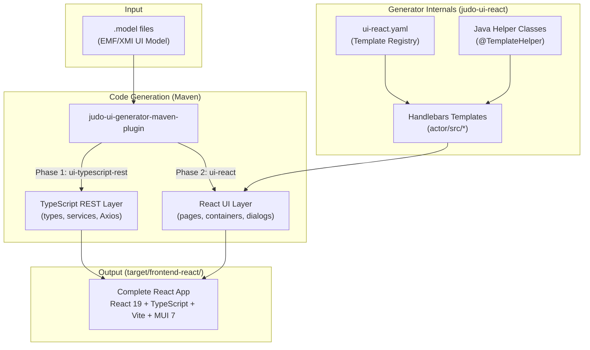
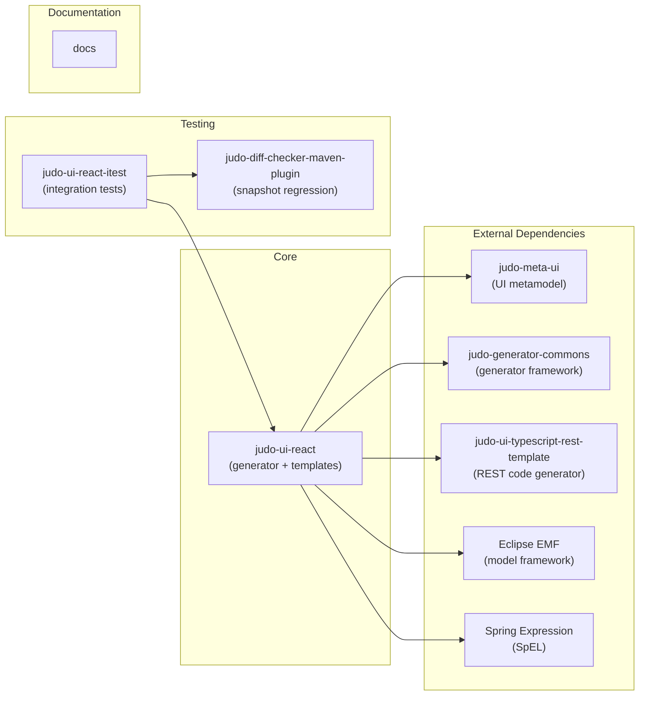
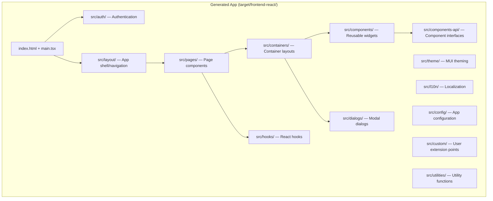

# judo-ui-react-template

A Java-based code generator that transforms JUDO UI Models (EMF/XMI) into production-ready React/TypeScript frontend applications. It is part of the [JUDO platform](https://github.com/BlackBeltTechnology) ecosystem by BlackBelt Technology.

The generated source code depends on the TypeScript REST layer produced by [judo-ui-typescript-rest-template](https://github.com/BlackBeltTechnology/judo-ui-typescript-rest-template). Both generators work together: the REST template generates API types, service interfaces, and Axios implementations, while this template generates the full React UI on top of them.

## Architecture Overview



### Module Dependency Graph



### Generated React App Structure

The templates under `judo-ui-react/src/main/resources/actor/` mirror the generated app structure:



## Usage

The `judo-ui-generator-maven-plugin` runs two generation phases inside a consumer project's POM. Here is a minimal example:

```xml
<project xmlns="http://maven.apache.org/POM/4.0.0" xmlns:xsi="http://www.w3.org/2001/XMLSchema-instance"
         xsi:schemaLocation="http://maven.apache.org/POM/4.0.0 https://maven.apache.org/xsd/maven-4.0.0.xsd">
    <modelVersion>4.0.0</modelVersion>

    <groupId>com.example</groupId>
    <artifactId>actiongrouptest-frontend-react-action_group_test__god</artifactId>
    <version>1.0.0-SNAPSHOT</version>
    <packaging>bundle</packaging>

    <properties>
        <!-- dependencies -->
        <judo-meta-ui-version>...</judo-meta-ui-version>
        <judo-generator-commons-version>...</judo-generator-commons-version>
        <judo-ui-typescript-rest-template-version>...</judo-ui-typescript-rest-template-version>
        <judo-ui-react-version>...</judo-ui-react-version>

        <!-- model properties -->
        <model-name>ActionGroupTest</model-name>
        <actor>actiongrouptest__god</actor>
        <actor-fq-name>ActionGroupTest::God</actor-fq-name>

        <!-- generator properties -->
        <ui-model>${project.basedir}/model/${model-name}-ui.model</ui-model>
        <generation-target>${project.basedir}/target/frontend-react</generation-target>

        <!-- npm package properties -->
        <appScope>@example</appScope>
        <appVersion>1.0.0</appVersion>
        <tablePageLimit>10</tablePageLimit>
    </properties>

    <build>
        <plugins>
            <plugin>
                <groupId>hu.blackbelt.judo.meta</groupId>
                <artifactId>judo-ui-generator-maven-plugin</artifactId>
                <version>${judo-meta-ui-version}</version>
                <executions>
                    <!-- Phase 1: Generate TypeScript REST services -->
                    <execution>
                        <id>execute-ui-services-generation</id>
                        <phase>generate-sources</phase>
                        <goals><goal>generate</goal></goals>
                        <configuration>
                            <uris>
                                <uri>mvn:hu.blackbelt.judo.generator:judo-ui-typescript-rest-api:${judo-ui-typescript-rest-template-version}</uri>
                                <uri>mvn:hu.blackbelt.judo.generator:judo-ui-typescript-rest-service:${judo-ui-typescript-rest-template-version}</uri>
                                <uri>mvn:hu.blackbelt.judo.generator:judo-ui-typescript-rest-axios:${judo-ui-typescript-rest-template-version}</uri>
                            </uris>
                            <type>ui-typescript-rest</type>
                            <applications>${actor-fq-name}</applications>
                            <ui>${ui-model}</ui>
                            <destination>${generation-target}/src/generated</destination>
                        </configuration>
                    </execution>

                    <!-- Phase 2: Generate React UI -->
                    <execution>
                        <id>execute-ui-generation</id>
                        <phase>generate-sources</phase>
                        <goals><goal>generate</goal></goals>
                        <configuration>
                            <uris>
                                <uri>mvn:hu.blackbelt.judo.generator:judo-ui-react:${judo-ui-react-version}</uri>
                            </uris>
                            <type>ui-react</type>
                            <applications>${actor-fq-name}</applications>
                            <ui>${ui-model}</ui>
                            <destination>${generation-target}</destination>
                            <templateParameters>
                                <appModelName>${model-name}</appModelName>
                                <appScope>${appScope}</appScope>
                                <appVersion>${appVersion}</appVersion>
                                <tablePageLimit>10</tablePageLimit>
                            </templateParameters>
                        </configuration>
                    </execution>
                </executions>

                <dependencies>
                    <dependency>
                        <groupId>hu.blackbelt.judo.generator</groupId>
                        <artifactId>judo-ui-typescript-rest-commons</artifactId>
                        <version>${judo-ui-typescript-rest-template-version}</version>
                    </dependency>
                    <!-- ... rest-api, rest-service, rest-axios, judo-ui-react -->
                </dependencies>
            </plugin>

            <!-- Unpack external packages (repackaged npm dependencies) -->
            <plugin>
                <groupId>org.apache.maven.plugins</groupId>
                <artifactId>maven-dependency-plugin</artifactId>
                <version>3.3.0</version>
                <executions>
                    <execution>
                        <id>external-packages</id>
                        <phase>generate-sources</phase>
                        <goals><goal>unpack</goal></goals>
                        <configuration>
                            <artifactItems>
                                <artifactItem>
                                    <groupId>hu.blackbelt.judo.generator</groupId>
                                    <artifactId>judo-ui-react-external-packages</artifactId>
                                    <version>${judo-ui-react-version}</version>
                                    <type>jar</type>
                                    <overWrite>true</overWrite>
                                </artifactItem>
                            </artifactItems>
                            <includes>externals/**</includes>
                            <outputDirectory>${generation-target}</outputDirectory>
                        </configuration>
                    </execution>
                </executions>
            </plugin>
        </plugins>
    </build>
</project>
```

This generates a complete application into the `target/frontend-react` directory.

> **Note:** The `maven-dependency-plugin` copies repackaged dependencies from the module `judo-ui-react-external-packages`.

The `judo-ui-generator-maven-plugin` documentation is maintained in the [judo-meta-ui](https://github.com/BlackBeltTechnology/judo-meta-ui/tree/develop/generator-maven-plugin) repository.

## Documentation

Detailed documentation for the generated apps and how to maintain/modify them can be found under the [docs/pages](docs/pages) folder.
