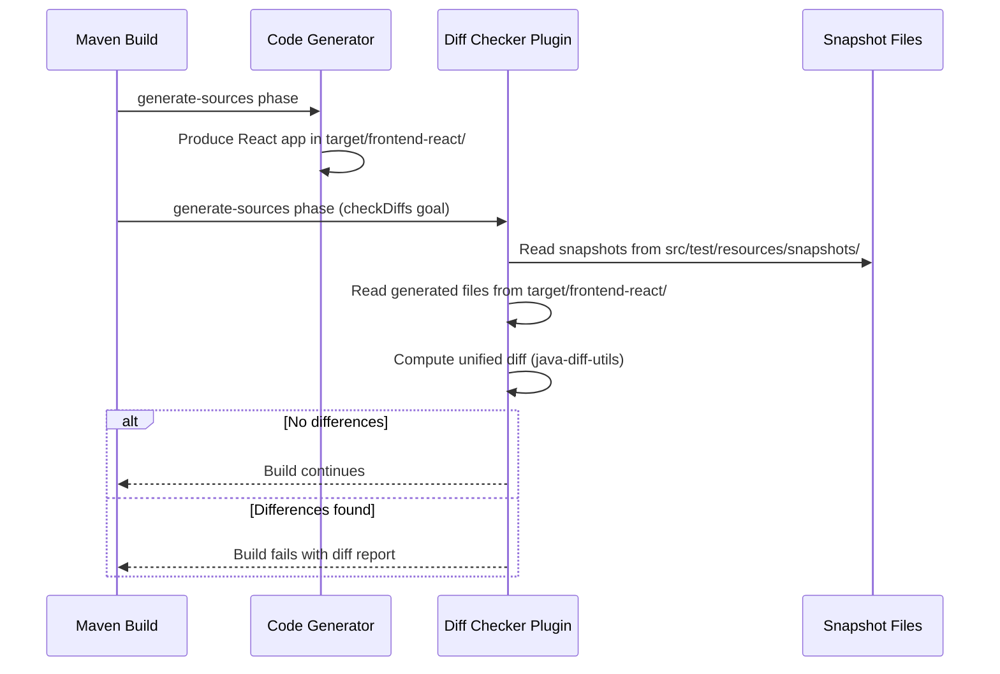

# judo-diff-checker-maven-plugin

A Maven plugin that compares generated files against committed snapshots and highlights any differences. It is used in the integration test pipeline to detect unexpected changes in generated output when templates or helpers are modified.

## How It Works



## Usage

Add the plugin to a project's POM with a list of files to check:

```xml
<plugin>
    <groupId>hu.blackbelt.judo.generator</groupId>
    <artifactId>judo-diff-checker-maven-plugin</artifactId>
    <version>${revision}</version>
    <executions>
        <execution>
            <goals>
                <goal>checkDiffs</goal>
            </goals>
            <phase>generate-sources</phase>
        </execution>
    </executions>
    <configuration>
        <sourceDirectory>${project.basedir}/target/frontend-react/</sourceDirectory>
        <snapshotDirectory>${project.basedir}/src/test/resources/snapshots/frontend-react/</snapshotDirectory>
        <sources>
            <source>src/pages/God/God/Galaxies/AccessViewPage/index.tsx</source>
            <source>src/pages/God/God/Galaxies/AccessTablePage/index.tsx</source>
            <!-- add more files to track -->
        </sources>
    </configuration>
</plugin>
```

## Configuration Options

| Option | Default | Description |
|--------|---------|-------------|
| `sourceDirectory` | *(required)* | Directory containing the freshly generated files |
| `snapshotDirectory` | *(required)* | Directory containing the committed snapshot files |
| `sources` | *(required)* | List of relative file paths to compare |
| `createSnapshotIfNotExists` | `true` | Automatically create snapshot files if they don't exist yet |
| `forceSnapshotOverwrite` | `false` | Overwrite snapshot files with generated content before comparing. Useful during refactors where you expect no changes |
| `snapshotPostfix` | `".snapshot"` | Suffix appended to snapshot file names |

## Dependencies

The plugin uses [java-diff-utils](https://github.com/java-diff-utils/java-diff-utils) (v4.12) for computing unified diffs between files.
